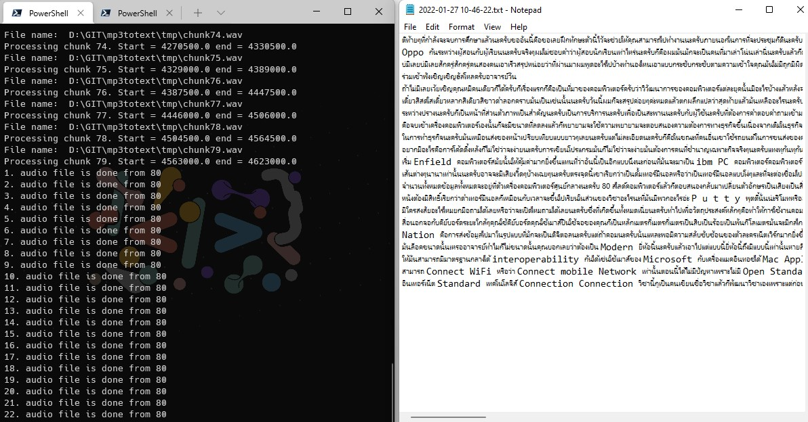

# mp3totext

This program helps to convert .mp3 to .wav and the audio file to text. 

> Python 3.6

### Installation
Use the package manager [pip](https://pip.pypa.io/en/stable/) to install foobar.
```sh
$ sudo pip3 install SpeechRecognition
$ sudo pip3 install pydub
```
## Usage

edit inputfile.py to your wav file name (if you have mp3.you need to convert it before)

```python
python3 ./main.py
```




## License
[MIT](https://choosealicense.com/licenses/mit/)
